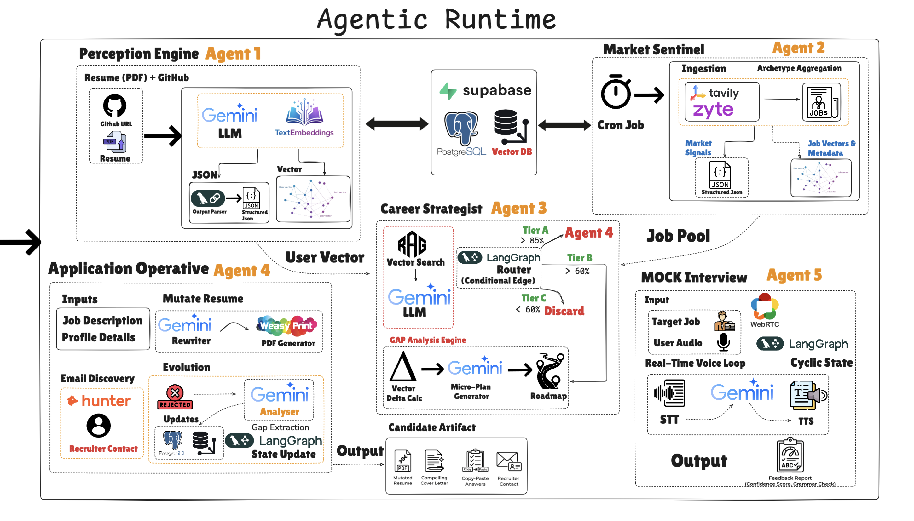
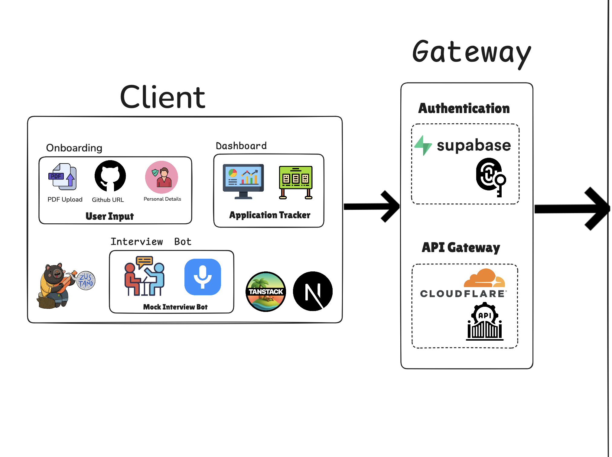

# ERFOLG

<div align="center">

  

  <h1>ERFOLG</h1>
  
  <p>
    <strong>Your Autonomous AI Career Companion</strong>
  </p>

  <p>
    <a href="https://github.com/Rishiikesh-20/Erflog/stargazers">
      
    </a>
    <a href="https://github.com/Rishiikesh-20/Erflog/network/members">
      
    </a>
    <a href="https://github.com/Rishiikesh-20/Erflog/issues">
      
    </a>
    <a href="LICENSE">
      
    </a>
  </p>

  <p>
    
    
    
    
    <br/>
    
    
    
    
    
    
  </p>

  <p>
    <em>Moving beyond static job boards to an intelligent system that acts, plans, and thinks for your career.</em>
  </p>

  <p>
    <a href="#-about-the-project"><strong>Explore the Docs »</strong></a>
    <br />
    <br />
    <a href="#-key-features">View Demo</a>
    ·
    <a href="https://github.com/Rishiikesh-20/Erflog/issues">Report Bug</a>
    ·
    <a href="https://github.com/Rishiikesh-20/Erflog/issues">Request Feature</a>
  </p>
</div>

<br />

<p align="center">
  <a href="#about-the-project">About</a> •
  <a href="#key-features">Features</a> •
  <a href="#agents">Agents</a> •
  <a href="#tech-stack">Tech Stack</a> •
  <a href="#how-it-works">How It Works</a> •
  <a href="#quick-start">Quick Start</a> •
  <a href="#team">Team</a>
</p>

<br />

## Demo

https://github.com/user-attachments/assets/dbc98028-ed5b-4321-b2d3-73bb54646128

<br />

## 📋 About The Project

**ERFOLG** (German for "success") is a sophisticated **Multi-Agent AI System** that operates as your **24/7 Autonomous Career Manager**. Unlike traditional job boards that require constant manual effort, ERFOLG actively works in the background to bridge the gap between where you are and where you want to be in your career.

The system operates through six specialized AI agents working in three intelligent loops:

| Loop | Action | What It Does |
|:----:|:------:|:-------------|
| 🧠 | **THINK** | Continuously scans your resume against real-time market demands using semantic search and vector embeddings to identify specific skill gaps. |
| 📋 | **PLAN** | Auto-generates personalized learning roadmaps with DAG visualizations, daily study plans, and curated resources—all dynamically updated based on market changes. |
| ⚡ | **ACT** | Proactively discovers relevant opportunities, auto-tailors resumes for each job with ATS optimization, generates cover letters, and can even auto-fill applications. |

<br />

### The Problem We Solve

| Traditional Approach | ERFOLG Approach |
|:---------------------|:-------|
| ❌ Manual, endless job scrolling | ✅ **Autonomous** multi-source job aggregation (JSearch, Mantiks, SerpAPI) |
| ❌ Generic resume for all jobs | ✅ **AI-tailored resumes** with ATS scoring for every application |
| ❌ Guessing skill gaps | ✅ **Real-time semantic gap analysis** with percentage-based matching |
| ❌ No learning from rejections | ✅ **Rejection Feedback Loop** that learns and adapts roadmaps |
| ❌ Chatbots forget context | ✅ **Long-term memory** via Pinecone vector storage |
| ❌ Manual interview prep | ✅ **Context-aware mock interviews** (text + voice) with staged feedback |
| ❌ Generic career advice | ✅ **Personalized daily recommendations** with recency boosting |

<br />

## 🎯 Unique Selling Proposition

<table>
<tr>
<td width="50%" valign="top">

### The Rejection Feedback Loop

The **only system** that transforms failure into targeted growth:

1. Analyzes **why** you were rejected using AI
2. Parses rejection emails and feedback automatically
3. **Dynamically updates** your learning roadmap with missing skills
4. Directs you to specific resources to close gaps
5. Adjusts future job recommendations based on lessons learned

**Example**: Rejected for lacking AWS experience? The system automatically adds AWS modules to your 3-day learning plan and adjusts your job matches accordingly.

</td>
<td width="50%" valign="top">

### True Autonomous Agency

ERFOLG doesn't wait for you to log in—it operates **24/7** via automated cron jobs:

**Daily Market Scan**: Every day, Agent 2 aggregates 30+ jobs, 10-20 hackathons, and 10 news articles from multiple sources.

**Daily Personalized Matching**: Agent 3 runs semantic searches for every user, calculates match percentages, generates roadmaps, and pre-writes cover letters.

> *"Hi! A new Senior React Role at Netflix matches your skills 95%. I've prepared your tailored resume and cover letter. Shall I review?"*

**It works while you sleep.**

</td>
</tr>
</table>

<br />

## 🏗️ Architecture

<div align="center">
  
</div>

<br />

<details>
<summary><b>🔍 Click to view Deep Dive into Components</b></summary>
<br>

#### Agentic Runtime
The core brain orchestrating the multi-agent system with LangGraph state machines.

<div align="center">
  
</div>

<br>

#### Client Gateway
Handling user interactions and API requests via FastAPI and Next.js.

<div align="center">
  
</div>

</details>

<br />

## 🔄 Execution Flow

<div align="center">
  
</div>

<br />

## ✨ Key Features

| Feature | Description |
|:-------:|:------------|
| 📄 **Smart Profile Parsing** | Extracts skills, projects, and experience from PDF resumes using PyMuPDF and Google Gemini 2.0 Flash. Generates 768-dimension vector embeddings for semantic matching. |
| 🔍 **Live Market Sentinel** | Autonomous daily cron job that aggregates from **JSearch**, **Mantiks**, **SerpAPI** (30 jobs), **Devpost/MLH** (10-20 hackathons), **Tavily/NewsData.io** (10 tech news). Deduplicates via consistent UUID generation. |
| 📊 **Semantic Gap Analysis** | Uses Pinecone vector search to find semantically similar jobs. Calculates match percentages with **60% semantic similarity + 40% recency boost**. Classifies into Tier A (≥80%, ready) or Tier B (<80%, needs roadmap). |
| 🗺️ **Dynamic Learning Roadmaps** | Auto-generates **3-day study plans** with DAG visualizations, day-by-day schedules, and curated resources. Updates dynamically based on rejection feedback and market changes. |
| 📝 **AI Application Kit** | Auto-tailors resumes using WeasyPrint/LaTeX engines with **ATS scoring (0-100)**. Pre-generates cover letters and "why join" responses using context-aware prompts. |
| 🤖 **Auto-Apply Agent** | Uses **browser-use + Playwright** to autonomously fill job application forms, upload resumes, and stop before final submit for user review. |
| 🎤 **Context-Aware Mock Interviews** | Conducts **technical and HR interviews** via text or voice (Google Speech-to-Text/TTS). Uses **LangGraph state machines** with 4-stage interview flow (Intro → Resume Deep-Dive → Gap Challenge → Conclusion). |
| 💻 **LeetCode Practice Hub** | Curated **Blind 75** problems with AI-powered recommendations based on user's LeetCode profile and skill gaps. Tracks progress in Supabase. |
| 🔄 **GitHub Watchdog** | Monitors GitHub commits to verify and discover new skills from actual code contributions, keeping profiles dynamically updated. |
| 🧠 **Vector Memory System** | Stores all profiles, jobs, and interactions as embeddings in Pinecone for true long-term memory and semantic retrieval. |

<br />

## 🤖 The Six AI Agents

| Agent | Name | Core Function | Key Technologies | Documentation |
|:-----:|:-----|:--------------|:----------------|:-------------:|
| 1️⃣ | **Perception** | **Profile Analyst**<br>Resume parsing, skill extraction, GitHub monitoring, vector embedding generation | PyMuPDF, Google Gemini 2.0, Pinecone, Supabase Storage | [Read Docs](./backend/agents/agent_1_perception/README.md) |
| 2️⃣ | **Market** | **Market Scout**<br>Daily job/hackathon/news aggregation from multiple sources via automated cron | JSearch, Mantiks, SerpAPI, Tavily, Devpost APIs | [Read Docs](./backend/agents/agent_2_market/README.md) |
| 3️⃣ | **Strategist** | **Career Coach**<br>Semantic matching, gap analysis, tiered classification, roadmap generation | Pinecone Vector Search, LangChain, Google Gemini | [Read Docs](./backend/agents/agent_3_strategist/README.md) |
| 4️⃣ | **Operative** | **Headhunter**<br>Resume mutation, ATS scoring, PDF generation, auto-apply automation | WeasyPrint, LaTeX, browser-use, Playwright | [Read Docs](./backend/agents/agent_4_operative/README.md) |
| 5️⃣ | **Mock Interview** | **Interview Coach**<br>Context-aware technical & HR interviews with staged feedback | LangGraph, Google Cloud Speech, WebSockets | [Read Docs](./backend/agents/agent_5_mock_interview/README.md) |
| 6️⃣ | **LeetCode** | **DSA Practice Guide**<br>AI-powered coding problem recommendations and progress tracking | Blind 75 Dataset, Google Gemini, Supabase | [Read Docs](./backend/agents/agent_6_leetcode/README.md) |

<br />

### 🔍 Agent Deep Dive

<details>
<summary><b>Agent 1: Perception - Profile Analyst</b></summary>

**Capabilities:**
- PDF resume parsing with PyMuPDF and PyPDF
- Structured data extraction to JSON using Google Gemini 2.0 Flash
- 768-dimension vector embedding generation via Google GenAI
- GitHub repository analysis and skill verification
- Skill assessment quiz generation for onboarding
- S3-compatible Supabase storage for PDFs
- Pinecone vector storage for semantic search

**API Endpoints:**
- `POST /api/perception/upload-resume` - Upload and process resume
- `POST /api/perception/sync-github` - Trigger GitHub synchronization
- `GET /api/perception/profile` - Retrieve user profile
- `POST /api/perception/onboarding/complete` - Complete onboarding workflow

</details>

<details>
<summary><b>Agent 2: Market - Market Scout</b></summary>

**Capabilities:**
- **Automated Daily Cron Job** - Runs autonomously every 24 hours
- **Multi-Source Job Aggregation:**
  - JSearch (RapidAPI): Frontend, Backend, Web, Mobile roles
  - Mantiks: Security, Enterprise, Cloud roles
  - SerpAPI (Google Jobs): Web3, AI/ML, Data Science roles
- **Hackathon Discovery**: Devpost, Devfolio, MLH, Gitcoin
- **Tech News Aggregation**: Tavily, NewsData.io, SerpAPI
- **Intelligent Deduplication**: Consistent UUID generation
- **Data Normalization**: Unified schemas across all sources

**Daily Collection Targets:**
- 30 Jobs across multiple domains
- 10-20 Hackathons
- 10 Tech News articles

</details>

<details>
<summary><b>Agent 3: Strategist - Career Coach</b></summary>

**Capabilities:**
- **Semantic Job Matching**: Pinecone vector search with 60% similarity + 40% recency weighting
- **Tiered Classification:**
  - **Tier A (Ready)**: ≥80% match score - no roadmap needed
  - **Tier B (Improvement)**: <80% match score - learning roadmap auto-generated
- **Gap Analysis**: Percentage-based skill gap identification
- **3-Day Learning Roadmaps**: DAG visualizations, daily schedules, resource links
- **Application Text Pre-Generation**: Cover letters, "why join" responses
- **Rejection Analysis Integration**: Updates roadmaps based on feedback

**API Endpoints:**
- `GET /api/strategist/today-data` - Get personalized daily matches
- `POST /api/strategist/roadmap` - Generate custom learning roadmap

</details>

<details>
<summary><b>Agent 4: Operative - Headhunter</b></summary>

**Capabilities:**
- **Resume Mutation**: AI-powered tailoring for each job description
- **ATS Scoring**: 0-100 compatibility score calculation
- **Multi-Format PDF Generation:**
  - WeasyPrint (HTML/CSS to PDF)
  - LaTeX Engine (professional formatting)
  - DOCX Engine (Word documents)
- **Auto-Apply Automation:**
  - Browser-use library integration
  - Playwright-powered form filling
  - Automatic resume uploads
  - User review before final submission
- **Application Tracking**: Status management in Supabase
- **Rejection Analysis**: AI-powered feedback parsing

**API Endpoints:**
- `POST /agent4/generate-resume` - Generate tailored resume
- `POST /agent4/ats-score` - Calculate ATS compatibility
- `POST /agent4/auto-apply` - Launch auto-apply agent
- `POST /agent4/analyze-rejection` - Analyze rejection feedback

</details>

<details>
<summary><b>Agent 5: Mock Interview - Interview Coach</b></summary>

**Capabilities:**
- **Dual Modes**: Text chat and voice-based interviews
- **Interview Types:**
  - Technical Interview (6 turns, 4 stages)
  - HR Interview (6 turns, 4 stages)
- **4-Stage Flow:**
  1. Intro - Welcome and self-introduction
  2. Resume Deep-Dive - Questions on skills/projects
  3. Gap Challenge - Questions on missing skills
  4. Conclusion - Wrap-up and detailed feedback
- **Context-Aware Questions**: Based on job description, user profile, and previous answers
- **LangGraph State Machine**: Maintains conversation state with memory checkpoints
- **Audio Processing**: Google Cloud Speech-to-Text and Text-to-Speech

**WebSocket Endpoints:**
- `WS /ws/interview/text/{job_id}` - Text interview
- `WS /ws/interview/{job_id}` - Voice interview
- `POST /api/interview/chat` - REST chat endpoint

</details>

<details>
<summary><b>Agent 6: LeetCode - DSA Practice Guide</b></summary>

**Capabilities:**
- **Blind 75 Problem Set**: Curated essential coding problems
- **AI-Powered Recommendations**: Uses Google Gemini to suggest problems based on:
  - User's current skill level
  - LeetCode profile statistics
  - Already solved problems
  - Identified skill gaps
- **Category Organization**: Arrays, Trees, Dynamic Programming, Graphs, etc.
- **Progress Tracking**: Supabase-backed completion status

**API Endpoints:**
- `GET /api/leetcode/problems` - Retrieve all problems
- `POST /api/leetcode/recommendations` - Get AI-powered recommendations
- `POST /api/leetcode/progress` - Update completion status

</details>

<br />

## 💻 Tech Stack

### Backend Stack

<div align="center">

| Core | AI/ML | Backend Services | Database | Tools |
|:----:|:-----:|:----------------:|:--------:|:-----:|
|  |  |  |  |  |
|  |  |  |  |  |
|  |  |  | |  |

</div>

**Key Dependencies:**
- **FastAPI 0.115.0** - High-performance async API framework
- **LangChain 0.3.14** - LLM orchestration and chaining
- **LangGraph 0.2.60** - Multi-agent state machine framework
- **Google Gemini 2.0 Flash** - Primary LLM for text generation and analysis
- **Pinecone** - Vector database for semantic search (768-dim embeddings)
- **Supabase** - PostgreSQL database + Auth + S3-compatible storage
- **Redis** - Caching layer for performance optimization
- **browser-use** - Browser automation for auto-apply feature
- **Playwright** - Headless browser control
- **PyMuPDF, PyPDF** - PDF parsing and text extraction
- **WeasyPrint** - HTML/CSS to PDF conversion
- **Google Cloud Speech** - Speech-to-Text and Text-to-Speech

### Frontend Stack

<div align="center">

| Framework | Styling | UI Components | Utilities |
|:---------:|:-------:|:-------------:|:---------:|
|  |  |  |  |
|  |  |  |  |
| |  | | |

</div>

**Key Features:**
- **Next.js 16.1.1** - React framework with App Router
- **React 19.2.3** - Latest React with concurrent features
- **Tailwind CSS 4** - Utility-first styling
- **Radix UI** - Headless accessible components
- **Framer Motion + GSAP** - Smooth animations
- **Supabase JS** - Client-side authentication and real-time subscriptions

<br />

## 🔄 How It Works

### 1️⃣ User Onboarding Flow
```
User uploads PDF resume 
  ↓
Agent 1 extracts text via PyMuPDF 
  ↓
Google Gemini 2.0 parses into structured JSON 
  ↓
Generates 768-dim vector embedding 
  ↓
Stores in Supabase (PostgreSQL + Storage) + Pinecone 
  ↓
Optional: GitHub Watchdog syncs repositories for skill verification
```

### 2️⃣ Daily Market Scan (Automated Cron Job)
```
Agent 2 runs at midnight daily 
  ↓
Aggregates all users' target roles and preferences 
  ↓
Queries JSearch, Mantiks, SerpAPI for 30 jobs 
  ↓
Fetches 10-20 hackathons from Devpost, MLH, Gitcoin 
  ↓
Aggregates 10 tech news from Tavily, NewsData.io, SerpAPI 
  ↓
Normalizes data to unified schema 
  ↓
Generates consistent UUIDs for deduplication 
  ↓
Stores in Supabase + Pinecone with vector embeddings
```

### 3️⃣ Personalized Matching (Automated Cron Job)
```
Agent 3 runs daily for each user 
  ↓
Queries Pinecone for semantically similar jobs 
  ↓
Calculates match score: 60% semantic similarity + 40% recency 
  ↓
Classifies: Tier A (≥80%, ready) or Tier B (<80%, needs roadmap) 
  ↓
For Tier B: Generates 3-day learning roadmap with DAG 
  ↓
Pre-generates cover letter and application text 
  ↓
Stores personalized matches in today_data table
```

### 4️⃣ User Dashboard Experience
```
User opens dashboard 
  ↓
Fetches today_data from Supabase 
  ↓
Displays: Matched jobs, Hackathons, Tech news 
  ↓
For each job: Match %, Roadmap (if applicable), Pre-written cover letter 
  ↓
User can: Apply, Start roadmap, Schedule mock interview
```

### 5️⃣ Job Application Flow
```
User clicks "Apply" on matched job 
  ↓
Agent 4 tailors resume for specific JD 
  ↓
Calculates ATS score (0-100) 
  ↓
Generates professional PDF via WeasyPrint/LaTeX 
  ↓
Optional: Auto-apply agent fills forms via Playwright 
  ↓
User reviews and submits 
  ↓
Application status tracked in Supabase
```

### 6️⃣ Interview Preparation
```
User starts mock interview for specific job 
  ↓
Agent 5 conducts context-aware interview 
  ↓
4-stage flow: Intro → Resume Deep-Dive → Gap Challenge → Conclusion 
  ↓
LangGraph maintains conversation state 
  ↓
Provides detailed feedback and improvement areas
```

### 7️⃣ Rejection Feedback Loop
```
User marks application as "Rejected" 
  ↓
Agent 4 analyzes rejection email/feedback 
  ↓
Identifies missing skills or reasons 
  ↓
Agent 3 updates user's learning roadmap 
  ↓
Adjusts future job recommendations 
  ↓
Continuous learning and improvement
```

<br />

## 💾 Database Schema

### Key Tables

| Table | Purpose | Key Fields |
|-------|---------|------------|
| `profiles` | User profiles and skills | `user_id`, `skills`, `experience`, `target_roles`, `embedding` |
| `jobs` | Aggregated job listings | `job_id`, `title`, `company`, `description`, `skills_required`, `embedding` |
| `hackathons` | Hackathon opportunities | `hackathon_id`, `title`, `prize`, `deadline`, `tech_stack` |
| `market_news` | Tech industry news | `news_id`, `title`, `content`, `source`, `published_at` |
| `today_data` | Daily personalized matches per user | `user_id`, `matched_jobs`, `match_scores`, `roadmaps`, `cover_letters` |
| `applications` | Job application tracking | `application_id`, `user_id`, `job_id`, `status`, `tailored_resume` |
| `leetcode_progress` | Coding practice progress | `user_id`, `problem_id`, `completed`, `difficulty` |

<br />

## 🚀 Quick Start

### Prerequisites

- **Python 3.11+**
- **Node.js 18+**
- **Docker & Docker Compose** (optional, for containerized deployment)
- **Supabase Account** (Database + Auth + Storage)
- **Pinecone Account** (Vector Database)
- **Google AI API Key** (Gemini 2.0)
- **Job API Keys** (JSearch, Mantiks, SerpAPI, Tavily)

---

### Option 1: Manual Installation

#### Backend Setup

1. **Clone the repository**
   ```bash
   git clone https://github.com/Rishiikesh-20/Erflog.git
   cd Erflog/backend
   ```

2. **Create virtual environment**
   ```bash
   python -m venv venv
   source venv/bin/activate  # On Windows: venv\Scripts\activate
   ```

3. **Install dependencies**
   ```bash
   pip install -r requirements.txt
   ```

4. **Install Playwright browsers** (for auto-apply feature)
   ```bash
   playwright install chromium
   playwright install-deps chromium
   ```

5. **Environment Setup**
   
   Create a `.env` file in `backend/`:
   ```properties
   # AI/LLM
   GEMINI_API_KEY=your_gemini_api_key
   
   # Database
   SUPABASE_URL=https://your-project.supabase.co/
   SUPABASE_KEY=your_supabase_anon_key
   SUPABASE_SERVICE_ROLE_KEY=your_service_role_key
   
   # Vector Database
   PINECONE_API_KEY=your_pinecone_api_key
   PINECONE_INDEX_NAME=ai-verse
   
   # Job APIs
   TAVILY_API_KEY=your_tavily_api_key
   JSEARCH_API_KEY=your_jsearch_api_key
   MANTIKS_API_KEY=your_mantiks_api_key
   SERP_API_KEY=your_serp_api_key
   
   # GitHub
   GITHUB_ACCESS_TOKEN=your_github_token
   
   # Caching
   REDIS_URL=redis://localhost:6379
   ```

6. **Run the Backend Server**
   ```bash
   uvicorn main:app --reload --port 8000
   ```
   
   API will be available at `http://localhost:8000`
   
   API Docs at `http://localhost:8000/docs`

#### Frontend Setup

1. **Navigate to frontend directory**
   ```bash
   cd ../erflog
   ```

2. **Install dependencies**
   ```bash
   npm install
   ```

3. **Environment Setup**
   
   Create a `.env.local` file:
   ```properties
   NEXT_PUBLIC_SUPABASE_URL=your_supabase_url
   NEXT_PUBLIC_SUPABASE_ANON_KEY=your_supabase_anon_key
   NEXT_PUBLIC_API_URL=http://localhost:8000
   ```

4. **Run the Frontend**
   ```bash
   npm run dev
   ```
   
   Frontend will be available at `http://localhost:3000`

---

### Option 2: Docker Setup (Recommended)

#### Quick Start with Docker Compose

1. **Clone the repository**
   ```bash
   git clone https://github.com/Rishiikesh-20/Erflog.git
   cd Erflog
   ```

2. **Create environment file**
   
   Create a `.env` file in the project root with all required variables:
   ```properties
   # AI/LLM
   GEMINI_API_KEY=your_gemini_api_key
   
   # Database
   SUPABASE_URL=https://your-project.supabase.co/
   SUPABASE_KEY=your_supabase_anon_key
   SUPABASE_SERVICE_ROLE_KEY=your_service_role_key
   
   # Vector Database
   PINECONE_API_KEY=your_pinecone_api_key
   PINECONE_INDEX_NAME=ai-verse
   
   # Job APIs
   TAVILY_API_KEY=your_tavily_api_key
   JSEARCH_API_KEY=your_jsearch_api_key
   MANTIKS_API_KEY=your_mantiks_api_key
   SERP_API_KEY=your_serp_api_key
   
   # GitHub
   GITHUB_ACCESS_TOKEN=your_github_token
   
   # Frontend
   NEXT_PUBLIC_SUPABASE_URL=your_supabase_url
   NEXT_PUBLIC_SUPABASE_ANON_KEY=your_supabase_anon_key
   NEXT_PUBLIC_API_URL=http://localhost:8000
   ```

3. **Build and start all services**
   ```bash
   docker-compose up -d --build
   ```

4. **Access the application**
   | Service | URL |
   |---------|-----|
   | Frontend | http://localhost:3000 |
   | Backend API | http://localhost:8000 |
   | API Documentation | http://localhost:8000/docs |

#### Docker Commands Reference

| Command | Description |
|---------|-------------|
| `docker-compose up -d` | Start all services in background |
| `docker-compose up -d --build` | Build and start all services |
| `docker-compose down` | Stop all services |
| `docker-compose logs -f` | View logs (all services) |
| `docker-compose logs -f backend` | View backend logs only |
| `docker-compose logs -f frontend` | View frontend logs only |
| `docker-compose ps` | List running containers |
| `docker-compose restart backend` | Restart a specific service |
| `docker-compose exec backend bash` | Shell into backend container |
| `docker-compose down -v` | Stop and remove volumes |

#### Development Mode with Hot Reload

```bash
docker-compose -f docker-compose.dev.yml up -d
```

---

### Setting Up Cron Jobs (Autonomous Agents)

For autonomous 24/7 operation, set up daily cron jobs:

```bash
# Edit crontab
crontab -e

# Add the following lines:

# Market scan - Agent 2 (runs daily at midnight)
0 0 * * * cd /path/to/Erflog/backend && /path/to/venv/bin/python -m agents.agent_2_market.cron >> /var/log/erfolg/market.log 2>&1

# Personalized matching - Agent 3 (runs daily at 1 AM)
0 1 * * * cd /path/to/Erflog/backend && /path/to/venv/bin/python -m agents.agent_3_strategist.cron >> /var/log/erfolg/strategist.log 2>&1
```

> **Note:** If using Docker, cron jobs are automatically handled by the `cron` container.

---

### Verify Installation

1. **Check Backend Health**
   ```bash
   curl http://localhost:8000/health
   ```
   Expected response: `{"status": "healthy"}`

2. **Check API Documentation**
   
   Open `http://localhost:8000/docs` in your browser

3. **Check Frontend**
   
   Open `http://localhost:3000` in your browser

---

### Troubleshooting

<details>
<summary><b>WeasyPrint/Cairo errors on Linux</b></summary>

```bash
# Install system dependencies
sudo apt-get update
sudo apt-get install -y libpango-1.0-0 libpangocairo-1.0-0 libgdk-pixbuf2.0-0
```
</details>

<details>
<summary><b>Playwright browser not found</b></summary>

```bash
# Install Playwright browsers
playwright install chromium
playwright install-deps chromium
```
</details>

<details>
<summary><b>Redis connection refused</b></summary>

```bash
# Start Redis locally
sudo systemctl start redis

# Or with Docker
docker run -d -p 6379:6379 redis:7-alpine
```
</details>

<details>
<summary><b>Port already in use</b></summary>

```bash
# Find and kill process on port 8000
lsof -i :8000
kill -9 <PID>

# Or use a different port
uvicorn main:app --reload --port 8001
```
</details>
---

## 👥 Team

<div align="center">

<table>

  <tr>
<td align="center"><a href="https://github.com/Rishiikesh-20"><br /><sub><b>Rishiikesh S K</b></sub></a><br /></td>

<td align="center"><a href="https://github.com/Adhikkesh"><br /><sub><b>Adhikkesh S K</b></sub></a><br /></td>

<td align="center"><a href="https://github.com/JrGkOG"><br /><sub><b>Karthik G</b></sub></a><br /></td>

<td align="center"><a href="https://github.com/siddu28"><br /><sub><b>Sai Venkata Siddardha</b></sub></a><br /></td>


  </tr>

</table>

</div>

<br />

## 📄 License

Distributed under the MIT License. See LICENSE for more information.

<br />

<div align="center">

  <p>Made with ❤️ by the ERFOLG Team</p>

</div>
